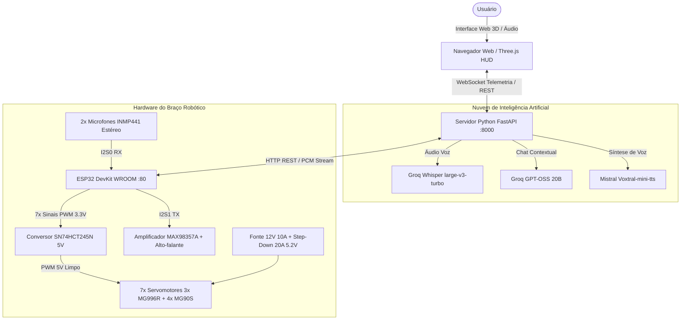

# 🤖 Braço Robótico ESP32 - Sistema Completo de Controle Cinemático, IA & Dança Rítmica

Sistema integrado para controle de um **Braço Robótico de 7 Servomotores** com microcontrolador **ESP32 DevKit WROOM**, conversor de nível lógico **SN74HCT245N**, sistema de áudio digital **I2S (Microfones INMP441 e Alto-falante MAX98357A)**, backend assíncrono em **Python FastAPI** e interface web moderna com **Three.js (Visualizador 3D com Cinemática Inversa e Gimbal)**.

---

## 📋 Índice
1. [Visão Geral e Arquitetura](#-visão-geral-e-arquitetura)
2. [Guia Completo: Instalação e Execução em Outro Computador](#-guia-completo-instalação-e-execução-em-outro-computador)
   - [Softwares Necessários no Sistema Operacional](#1-softwares-necessários-no-sistema-operacional)
   - [Método 1: Inicialização Rápida em 1 Clique (`iniciar_servidor.bat`)](#método-1-inicialização-rápida-recomendado---1-clique)
   - [Método 2: Instalação Manual Passo a Passo (PowerShell / Terminal)](#método-2-instalação-manual-passo-a-passo-terminal-powershell)
   - [Configuração do Arquivo `.env`](#4-configurar-as-chaves-de-api-no-env)
3. [Configuração e Flash do Firmware ESP32 (`roboticArm.ino`)](#-configuração-e-flash-do-firmware-esp32-roboticarmino)
4. [Guia de Funcionalidades da Interface Web](#-guia-de-funcionalidades-da-interface-web)
   - [Conexão e Teste de IP do ESP32 & Alternância de Tema](#1-conexão-e-teste-de-ip-do-esp32--alternância-de-tema)
   - [Visualizador 3D & Gimbal Cinemático na Garra](#2-visualizador-3d--gimbal-cinemático-na-garra)
   - [Limitações Mecânicas Reais Anti-Crippling](#-limitações-mecânicas-reais-anti-crippling)
   - [Conversação por Voz com IA & Localização Sonora (DOA)](#3-conversação-por-voz-com-ia--localização-sonora-doa)
   - [Música & Dança Sincronizada aos Beats](#4-música--dança-sincronizada-aos-beats)
   - [Calibração de Home & Mapeamento Dinâmico de Pinos](#5-calibração-de-home--mapeamento-dinâmico-de-pinos)
5. [Esquema Elétrico e Power Delivery](#-esquema-elétrico-e-power-delivery)
6. [Solução de Problemas (Troubleshooting)](#-solução-de-problemas-troubleshooting)

---

## 🌟 Visão Geral e Arquitetura

O sistema opera em uma arquitetura cliente-servidor distribuída:



---

## 💻 Guia Completo: Instalação e Execução em Outro Computador

Para configurar e rodar o projeto em um novo computador do zero (**Windows 10/11**, **Linux** ou **macOS**), instale os seguintes softwares essenciais:

### 1. Softwares Necessários no Sistema Operacional

| Software | Versão Recomendada | Função no Projeto | Instalação no Windows (PowerShell) | Instalação no Linux (Ubuntu/Debian) | Instalação no macOS (Homebrew) |
| :--- | :--- | :--- | :--- | :--- | :--- |
| **Python** | `3.10`, `3.11` ou `3.12` (64-bit) | Servidor FastAPI, processamento de áudio, cinemática e IA | `winget install Python.Python.3.12` | `sudo apt install python3 python3-venv python3-pip` | `brew install python` |
| **Node.js** | `v18+`, `v20+` ou `v22+` (LTS) | **Essencial:** Runtime JS exigido pelo `yt-dlp` para decodificar assinaturas e desafios do YouTube | `winget install OpenJS.NodeJS.LTS` | `sudo apt install nodejs` | `brew install node` |
| **FFmpeg** | `6.0+` ou `7.0+` | **Essencial:** Converte os formatos de áudio (MP3, WAV 16kHz, WebM e PCM para o ESP32) | `winget install Gyan.FFmpeg` | `sudo apt install ffmpeg` | `brew install ffmpeg` |
| **Git** | Qualquer versão moderna | Clonagem e controle de versão do repositório | `winget install Git.Git` | `sudo apt install git` | `brew install git` |
| **Arduino IDE** | `2.2+` ou `2.3+` | (Opcional) Apenas caso for compilar e regravar o firmware no ESP32 | `winget install Arduino.IDE` | Baixar AppImage oficial | `brew install --cask arduino-ide` |

> [!IMPORTANT]
> **Adicione os programas ao PATH do Sistema:**
> Ao instalar o Python manualmente no Windows pelo instalador `.exe`, certifique-se de marcar a caixa **"Add python.exe to PATH"**.
> 
> Para confirmar se tudo foi instalado e está acessível no terminal, abra um novo PowerShell/Terminal e execute:
> ```bash
> python --version   # Deve retornar Python 3.10, 3.11 ou 3.12
> node -v            # Deve retornar v18.x, v20.x ou v22.x
> ffmpeg -version    # Deve exibir a versão do FFmpeg
> git --version      # Deve exibir a versão do Git
> ```

---

### 2. Como Executar no Novo Computador

Você pode iniciar o projeto de duas formas: **automática (1 clique)** ou **manual (pelo terminal)**.

### Método 1: Inicialização Rápida (Recomendado - 1 Clique)
Na pasta raiz do projeto, basta dar **duplo clique no arquivo**:
```
iniciar_servidor.bat
```
O script automatizado irá:
1. Verificar se Python, Node.js e FFmpeg estão no PATH.
2. Criar automaticamente o ambiente virtual isolado (`venv`) caso ainda não exista.
3. Instalar/atualizar todas as bibliotecas necessárias listadas no `requirements.txt`.
4. Criar o arquivo `.env` a partir do template `.env.example`.
5. Abrir seu navegador padrão diretamente em `http://127.0.0.1:8000`.
6. Subir o servidor FastAPI na porta 8000 com live-reload.

---

### Método 2: Instalação Manual Passo a Passo (Terminal PowerShell)

#### 1. Clonar o Repositório
```powershell
git clone https://github.com/SEU_USUARIO/Esp32RoboticArm.git
cd Esp32RoboticArm
```

#### 2. Criar e Ativar o Ambiente Virtual Python
```powershell
python -m venv venv
.\venv\Scripts\activate
```
*(No Linux/macOS: `source venv/bin/activate`)*

#### 3. Instalar as Dependências do Python
```powershell
python -m pip install --upgrade pip
pip install -r requirements.txt
```

Principais pacotes incluídos no `requirements.txt`:
- `fastapi` e `uvicorn`: API REST de alta performance e servidor ASGI assíncrono.
- `websockets`: Telemetria bidirecional em tempo real a 30+ FPS.
- `httpx`: Comunicação HTTP assíncrona não bloqueante com o ESP32 e serviços de nuvem.
- `numpy` e `scipy`: Cálculos de Cinemática Inversa, Análise FFT rítmica e Localização Sonora (DOA via GCC-PHAT).
- `yt-dlp>=2026.8.19`: Extrator moderno de streaming do YouTube integrado com runtime Node.js.
- `edge-tts>=7.2.0`: Síntese de voz neural ultra-realista em Português do Brasil (100% sem sotaque).

#### 4. Configurar as Chaves de API no `.env`
Copie o template de exemplo:
```powershell
copy .env.example .env
```
Abra o `.env` gerado e configure suas chaves de API:
```ini
groq=gsk_SEU_TOKEN_GROQ_AQUI
voxtralArm=SEU_TOKEN_MISTRAL_AQUI
```
*(Se você não tiver chaves de nuvem no momento, todo o restante do sistema funciona normalmente: Simulador 3D, Cinemática Inversa, Gimbal, Sliders Manuais, Música & Dança e Pinos).*

#### 5. Iniciar o Servidor
```powershell
python -m uvicorn server.app:app --host 0.0.0.0 --port 8000 --reload
```
Acesse no seu navegador:
- No próprio computador: [http://127.0.0.1:8000](http://127.0.0.1:8000)
- Em qualquer outro smartphone ou notebook na mesma rede Wi-Fi: `http://IP_DO_SEU_PC:8000`

---

## ⚡ Configuração e Flash do Firmware ESP32 (`roboticArm.ino`)

### 1. Definir o IP e Wi-Fi no Início do `.ino`
Abra o arquivo `roboticArm.ino` no Arduino IDE. Logo nas primeiras linhas (linhas 40 a 60), localize a seção destacada:

```cpp
// ==============================================================================
//  >>> CONFIGURAÇÕES DE REDE & IP DO ESP32 (ALTERE AQUI ANTES DE FAZER O FLASH) <<<
// ==============================================================================

// 1. CONEXÃO COM SEU ROTEADOR WI-FI (MODO STATION)
const char* STA_SSID     = "SUA_REDE_WIFI";       // <-- Digite o nome da sua rede (2.4GHz)
const char* STA_PASSWORD = "SUA_SENHA_WIFI";     // <-- Digite a senha do seu Wi-Fi

// Defina 'true' para fixar o IP do ESP32 na sua rede local:
const bool  USAR_IP_ESTATICO_STA = true;

// IP Estático desejado para o ESP32 na sua rede local:
IPAddress   ESP32_IP_FIXO(192, 168, 1, 150);      // <--- DEFINE O IP DO ESP32 AQUI
IPAddress   ESP32_GATEWAY(192, 168, 1, 1);        // <--- IP do seu roteador
IPAddress   ESP32_SUBNET(255, 255, 255, 0);       // <--- Máscara de rede
IPAddress   ESP32_DNS(8, 8, 8, 8);                // <--- DNS do Google

// 2. REDE WI-FI PRÓPRIA CRIADA PELO ESP32 (MODO ACCESS POINT - AP)
const char* AP_SSID      = "BRACO_ESP32_AP";
const char* AP_PASSWORD  = "12345678";
IPAddress   AP_IP(192, 168, 4, 1);                // <--- IP padrão se conectar no AP direto
```

### 2. Configurações da Placa no Arduino IDE
No menu **Ferramentas** (Tools):
- **Placa (Board)**: `ESP32 Arduino -> ESP32 Dev Module`
- **Upload Speed**: `921600` (ou `115200` se o cabo USB for longo)
- **CPU Frequency**: `240MHz (WiFi/BT)`
- **Flash Frequency**: `80MHz`
- **Partition Scheme**: `Default 4MB with spiffs (1.2MB APP/1.5MB SPIFFS)` ou `Huge APP (3MB No OTA/1MB SPIFFS)`
- **Porta (Port)**: Selecione a porta COM correspondente ao seu ESP32 (ex: `COM3`, `COM5`).

### 3. Gravação (Upload)
1. Clique no botão **Carregar** (Upload / Ícone de Seta para a Direita).
2. Se a mensagem `Connecting.......` aparecer no console, pressione e segure o botão **BOOT** na placa ESP32 até iniciar a gravação.
3. Ao finalizar (`Done uploading`), abra o **Monitor Serial** (Ctrl+Shift+M) configurado em **115200 baud**.
4. Você verá a mensagem de inicialização exibindo o IP ativo atribuído:
   ```
   === BRAÇO ROBÓTICO ESP32 V8.0 INICIALIZANDO ===
   [Wi-Fi AP] Ponto de acesso próprio ativo: BRACO_ESP32_AP | IP: 192.168.4.1
   [Wi-Fi STA] Conectando a SUA_REDE_WIFI......
   [Wi-Fi STA] Conectado com sucesso!
   [Wi-Fi STA] IP ATRIBUÍDO AO ESP32: 192.168.1.150
   Servidor HTTP do ESP32 ativo na porta 80.
   ```

---

## 🖥️ Como Executar o Sistema

### 1. Iniciar o Servidor Python FastAPI
No terminal (dentro da pasta raiz do projeto):
```powershell
python -m uvicorn server.app:app --host 0.0.0.0 --port 8000 --reload
```

O terminal exibirá:
```
INFO:     Uvicorn running on http://0.0.0.0:8000 (Press CTRL+C to quit)
INFO:     Started server process
INFO:     Application startup complete.
```

### 2. Acessar a Interface Web
Abra seu navegador de preferência e acesse:
- **No próprio PC**: [http://127.0.0.1:8000](http://127.0.0.1:8000)
- **Pelo Smartphone ou Tablet na mesma rede Wi-Fi**: `http://IP_DO_SEU_COMPUTADOR:8000`

---

## 🎮 Guia de Funcionalidades da Interface Web

### 1. Conexão e Teste de IP do ESP32 & Alternância de Tema
Na barra superior do sistema:
- **Botão `☀️ Tema Claro / 🌙 Tema Escuro`**: Alterna instantaneamente entre o tema escuro industrial e um tema claro com contraste WCAG AA/AAA em todos os textos, cartões e botões. A cena 3D (Three.js), o piso e a neblina também se ajustam dinamicamente, e a preferência é salva no `localStorage` do navegador.
- **Campo `IP ESP32`**: Digite o IP configurado no firmware (ex: `192.168.1.150` ou `192.168.4.1` caso esteja no Access Point direto).
- **Botão `Testar Conexão` (ou tecla Enter)**: O backend realiza uma requisição de validação `/status` no ESP32.
  - Se online: o badge superior muda para verde: **● ESP32 Online (192.168.1.150)** e exibe aviso de sucesso.
  - Se offline: o sistema mantém o **● Simulador Virtual**, permitindo usar 100% das funções 3D, áudio e IA em modo de pré-visualização.

---

### 2. Visualizador 3D & Gimbal Cinemático na Garra
O visualizador renderiza fielmente todos os componentes CAD impressos em 3D:
- **Navegação de Câmera**:
  - **Botão Esquerdo do Mouse + Arrastar**: Rotacionar a câmera ao redor do braço.
  - **Botão Direito do Mouse + Arrastar**: Transladar (Pan) a cena.
  - **Roda do Mouse (Scroll)**: Zoom in e Zoom out (com iluminação balanceada e sem escurecimento de neblina).
- **Modelagem Realista da Garra, Punho e Servomotores**:
  - Todas as peças seguem o esquema real da montagem física ([`images/garra.png`](file:///c:/Users/Misha/Documents/GitHub/Esp32RoboticArm/images/garra.png)), com acabamento escuro industrial (`#1e293b`).
  - O punho `Bilek` conecta perfeitamente ao antebraço `On_Kol` com pino de articulação no Eixo X (Pitch) e base voltada para a frente.
  - A tampa superior `El_Ust.stl` assenta perfeitamente sobre os dedos e punho a $Y = +7.5\text{mm}$, fechando a estrutura da garra.
  - Servomotores micro MG90S modelados proceduralmente (carcaça azul-escura/metálica, engrenagem de latão e etiqueta roxa): um horizontal no punho para rotação da garra e um vertical na tampa superior para abertura/fechamento.
  - As pinças principais (`Parmak_2 X 2.stl`) e as bielas paralelas (`Parmak X 2.stl`) são montadas em par simétrico e espelhado, fechando no centro e abrindo paralelamente via rotação em tesoura no Eixo Y.
- **Controle Gimbal 3D com Cinemática Inversa Analítica Exata (IK)**:
  - O manipulador Gimbal está ancorado com precisão milimétrica **no ponto central de toque das pontas dos dedos da garra** (`clawTipTarget`), com erro posicional de **0.000 mm**.
  - **Permanência Absoluta na Ponta:** Ao soltar o Gimbal após uma iteração, o Gizmo **permanece fixado na ponta da garra**, permitindo que o usuário clique novamente lá embaixo e continue o movimento a partir daquele ponto exato.
  - **Proteção Anti-Snap (Zero 180° Snap):** O robô opera exclusivamente no semi-espaço frontal ($Z \ge 45\text{mm}$, azimute de $15^\circ$ a $165^\circ$), eliminando a singularidade que provocava o giro brusco de 180°.
  - **Proteção Anti-Enterramento e Anti-Colisão:** Altura mínima travada em $Y \ge 135\text{mm}$ sobre a base ($r \le 165\text{mm}$) e $Y \ge 35\text{mm}$ na bancada aberta.
  - **Limitações Mecânicas Reais Anti-Crippling (Anti-Auto-Interseção):**
    - **Cotovelo (`cotovelo`):** Estritamente limitado entre **$25^\circ$ e $105^\circ$** (acima de 105° o antebraço colide e penetra no braço).
    - **Ombro (`ombro`):** Limitado entre **$35^\circ$ e $145^\circ$** (evita colisão com a mesa giratória).
    - **Punho Pitch (`punho`):** Limitado entre **$35^\circ$ e $145^\circ$**.
    - **Base (`base_rotacao`):** Limitada entre **$15^\circ$ e $165^\circ$**.
    - **Raio Radial de Alcance Seguro:** Limitado entre $140\text{mm}$ e $380\text{mm}$.
  - **Barra de Espaço:** Pressione a barra de espaço enquanto arrasta o Gimbal para abrir ou fechar a garra rapidamente.
- **Sliders Manuais no HUD Direito**: Permitem o ajuste fino individual de cada junta com feedback de ângulo em graus e sliders limitados aos ranges mecânicos seguros.

---

### 3. Conversação por Voz com IA & Localização Sonora (DOA)
Na aba **IA Talk**:
1. **Seletor de Microfone**:
   - `Microfones do Braço (I2S - Seguir Usuário)`: Utiliza a matriz estéreo de microfones MEMS INMP441 instalados no braço.
   - `Microfone do Navegador`: Utiliza o microfone do seu computador/notebook.
2. **Localização Sonora (DOA - Direction of Arrival)**:
   - Quando o microfone do braço é usado, o algoritmo processa os canais Esquerdo e Direito com **ILD** (Interaural Level Difference) gerado pela barreira acústica física e **TDOA** (Time Difference of Arrival via GCC-PHAT a 16kHz).
   - O sistema calcula o ângulo relativo (-80° a +80°) e **gira automaticamente o servo da base (`base_rotacao`) na direção de quem estiver falando com o robô**!
   - Um badge visual `🎯 Voz detectada à Esquerda (+35°) -> Virando base para você!` surge na tela.
3. **Vozes Neurais em Português Brasileiro (Sem Sotaque)**:
   - **Antônio (`pt-BR-AntonioNeural`)**: Voz masculina nativa brasileira natural e fluida, sem nenhum sotaque estrangeiro.
   - **Francisca (`pt-BR-FranciscaNeural`)**: Voz feminina nativa brasileira de alta expressividade.
   - **Thalita (`pt-BR-ThalitaMultilingualNeural`)**: Opção feminina com entonação moderna.
   - **Paul (`en_paul_neutral`)**: Voz inglesa original da Mistral Voxtral (disponível para comparação).
   > [!NOTE]
   > A API oficial da Mistral Voxtral possui atualmente apenas 10 vozes pré-definidas em inglês (`en_us` e `en_gb`), o que causava pronúncia fonética com sotaque americano ao falar português. Além disso, a clonagem de vozes personalizadas na Mistral (`minhavoz.m4a`) está restrita a planos corporativos pagos (`HTTP 403`). A integração nativa do **Edge Neural TTS** solucionou esse problema com áudio brasileiro 100% natural, latência de ~1.2s e custo zero.
4. **Filtro de Ruído & Detecção Inteligente de Fala (VAD Anti-Teclado e Anti-Pássaros)**:
   - **Filtro Passa-Faixa Biquad (`bandpass` 300Hz - 3200Hz)**: Isola exclusivamente as frequências formantes da voz humana no Web Audio API. Corta agudos intensos (como cantos de pássaros externos de 4kHz a 8kHz) e ruídos de teclado/vibrações mecânicas (<200Hz e clicks secos).
   - **Slider de Sensibilidade / Limiar VAD (15 a 65, Padrão: 35)**: Ajustável diretamente na interface. Permite elevar o limiar em cômodos barulhentos para que cliques de teclas não mantenham o microfone aberto.
   - **Marcador Visual de Limiar**: O medidor de VU renderiza uma linha azul indicando o limiar de corte, facilitando calibrar a voz acima do ruído de fundo.
   - **Corte de Silêncio Rápido (800ms)**: Assim que o usuário termina a frase, o sistema encerra a gravação e envia o turno para a IA.
   - **Timer de Segurança (8s)**: Garante o auto-envio mesmo caso o usuário fale por tempo prolongado ou haja ruído contínuo.
   - **Botão `⏹️ Enviar` Imediato**: Permite forçar o envio da fala a qualquer instante com um clique, sem precisar aguardar o temporizador de silêncio.
5. **Pipeline Completo de Conversação**:
   - **Reconhecimento de Voz (STT)**: Groq Whisper (`whisper-large-v3-turbo`) em Português do Brasil.
   - **Raciocínio Contextual**: Groq Chat (`openai/gpt-oss-safeguard-20b`).
   - **Síntese de Voz (TTS)**: Síntese Neural Brasileira (Edge TTS / Mistral). O áudio é reproduzido tanto no navegador quanto transmitido via streaming PCM para o alto-falante I2S do braço, enquanto a garra faz gestos de fala sincronizados.

---

### 4. Música & Dança Sincronizada aos Beats
Na aba **Música & Dança**:
- **Download do YouTube**: Cole qualquer URL do YouTube e clique em `Baixar & Dançar`. O sistema extrai o áudio via `yt-dlp`.
- **Upload Local**: Envie seus próprios arquivos `.mp3` ou `.wav`.
- **Análise Rítmica Algorítmica**: O backend analisa o espectro de frequências, picos de transientes, ritmo e seções de energia (drops e calmaria).
- **Coreografia Procedural**: O robô executa movimentos sincronizados nos 7 servomotores a 25 FPS, alternando poses e gestos no tempo exato das batidas da música.

---

### 5. Calibração de Home & Mapeamento Dinâmico de Pinos
- **Botão `Bring Home`**: Retorna o braço imediatamente à postura segura de repouso (Home).
- **Personalizar Posição Home**: Permite definir um ângulo customizado para cada motor ou clicar em `Capturar Posição 3D Atual` para usar a pose corrente.
- **Mapeamento de Pinos ESP32 (`SN74HCT245N`)**: Abre uma janela com a pinagem de cada junta. Permite remapear os pinos GPIO diretamente via software sem necessidade de recompilar o firmware no Arduino IDE.
- **Parada de Emergência (`⏹️ Parada Geral`)**: Desliga instantaneamente as rotinas ativas de música e IA, interrompendo qualquer movimentação dos servos.

---

## ⚡ Esquema Elétrico e Power Delivery

O projeto foi projetado conforme as especificações rigorosas do **Descritivo Técnico - Esquema v8**:

### 1. Sistema de Alimentação (Power Delivery)
- **Fonte Chaveada 12V 10A (120W)**: Fornece alta margem de corrente e baixo aquecimento.
- **Módulo Step-Down 20A 300W regulado em 5.2V**:
  - Alimenta exclusivamente as linhas de alimentação dos 7 servomotores.
  - Tensão de 5.2V compensa a perda de carga nos cabos sob pico de torque dos servos MG996R.
- **Isolamento de Linhas**: O microcontrolador ESP32 é alimentado via cabo USB ou regulador 5V dedicado. **Todos os GNDs (Fonte, Step-Down, ESP32, Level Shifter e Servos) são unificados em um barramento comum**.

### 2. Conversor de Nível Lógico SN74HCT245N (3.3V -> 5.0V)
Os servomotores esperam pulsos PWM de amplitude 5V TTL. O conversor HCT245 atua como isolador e amplificador de sinal:
- **Pinos VCC**: 5.0V
- **Pino OE (Output Enable, pino 19)**: Conectado ao GND (sempre ativo).
- **Pino DIR (Direção, pino 1)**: Conectado ao VCC (direção A -> B).

### 3. Tabela Completa de Pinagem

| Junta / Periférico | Modelo | GPIO ESP32 | Entrada Level Shifter (A) | Saída Level Shifter (B) | Linha de Energia |
| :--- | :--- | :--- | :--- | :--- | :--- |
| **Garra Abertura** | MG90S | `GPIO 13` | Pino 2 (A1) | Pino 18 (B1) | 5.2V Step-Down |
| **Garra Rotação** | MG90S | `GPIO 14` | Pino 3 (A2) | Pino 17 (B2) | 5.2V Step-Down |
| **Ombro Master** | MG996R | `GPIO 27` | Pino 4 (A3) | Pino 16 (B3) | 5.2V Step-Down |
| **Cotovelo** | MG996R | `GPIO 26` | Pino 5 (A4) | Pino 15 (B4) | 5.2V Step-Down |
| **Base Rotação** | MG996R | `GPIO 25` | Pino 6 (A5) | Pino 14 (B5) | 5.2V Step-Down |
| **Ombro Slave** | MG90S | `GPIO 18` | Pino 7 (A6) | Pino 13 (B6) | 5.2V Step-Down |
| **Punho Pitch** | MG90S | `GPIO 19` | Pino 8 (A7) | Pino 12 (B7) | 5.2V Step-Down |
| **Mic INMP441 (WS)** | I2S0 RX | `GPIO 33` | Direto no ESP32 | - | 3.3V ESP32 |
| **Mic INMP441 (SCK)** | I2S0 RX | `GPIO 32` | Direto no ESP32 | - | 3.3V ESP32 |
| **Mic INMP441 (SD)** | I2S0 RX | `GPIO 35` (Input) | Direto no ESP32 | - | 3.3V ESP32 |
| **Alto-falante MAX98357A (LRC)**| I2S1 TX | `GPIO 21` | Direto no ESP32 | - | 5.0V Step-Down |
| **Alto-falante MAX98357A (BCLK)**| I2S1 TX | `GPIO 22` | Direto no ESP32 | - | 5.0V Step-Down |
| **Alto-falante MAX98357A (DIN)**| I2S1 TX | `GPIO 23` | Direto no ESP32 | - | 5.0V Step-Down |

---

## 🔧 Solução de Problemas (Troubleshooting)

### 1. ESP32 não responde no botão "Testar Conexão"
- Verifique no Serial Monitor do Arduino IDE (115200 baud) se o ESP32 conectou ao Wi-Fi e qual IP ele obteve.
- Certifique-se de que o computador onde o servidor FastAPI está rodando está conectado na **mesma rede Wi-Fi / roteador** que o ESP32.
- Caso não tenha roteador disponível no momento, conecte o Wi-Fi do seu computador na rede do próprio ESP32 (`BRACO_ESP32_AP`, senha `12345678`) e teste o IP `192.168.4.1`.

### 2. O microfone do navegador não ativa
- Em navegadores baseados no Chromium, o acesso ao microfone via `getUserMedia` requer conexão via `http://localhost`, `http://127.0.0.1` ou `https://`. Ao acessar de outro computador via IP local, use o modo `Microfones do Braço (I2S)`.

### 3. Servomotores tremendo ou reiniciando o ESP32
- Certifique-se de que o terra (GND) do Step-Down está firmemente conectado ao pino GND do ESP32.
- Meça com um multímetro a saída do Step-Down sob carga: a tensão não deve cair abaixo de 4.9V quando os 3 servos MG996R se movem simultaneamente.

### 4. Erro ao sintetizar áudio ou transcrever
- Verifique se o comando `ffmpeg -version` funciona no terminal.
- Certifique-se de que as chaves de API no arquivo `.env` estão preenchidas corretamente e possuem cotas ativas no provedor Groq e Mistral.
